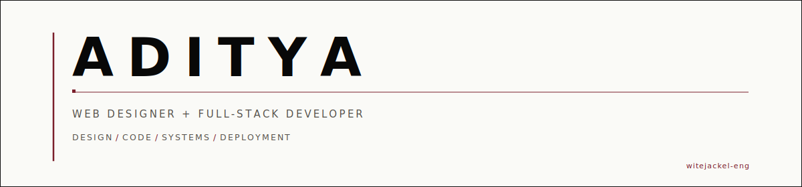
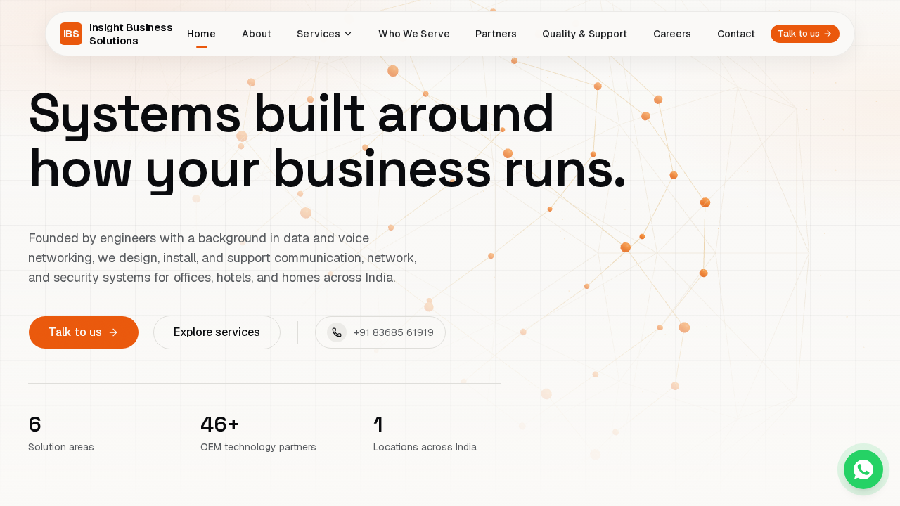
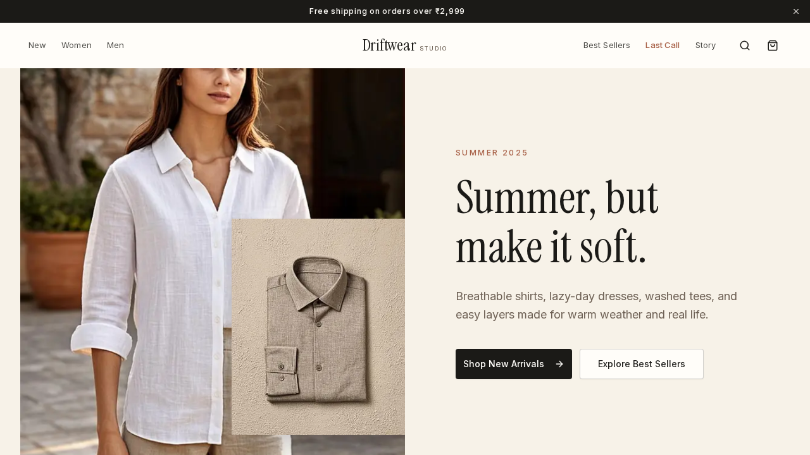
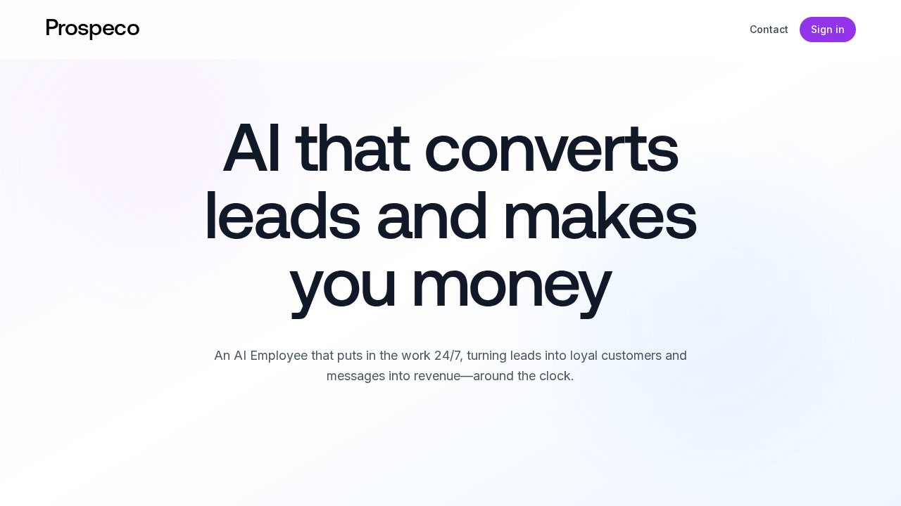
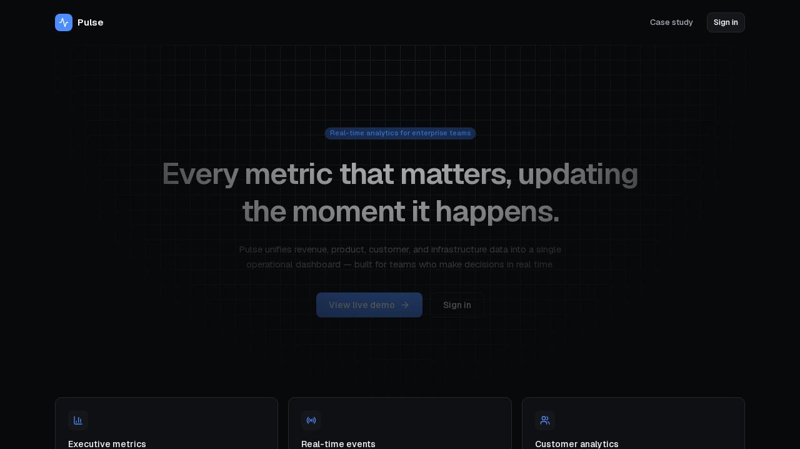

  

I design and build websites and web products that convert — from strategy and interface design through code, integrations, and deployment. I work with businesses in India and internationally, creating sites that make the offer clear, establish credibility, and give visitors an obvious path to contact.

My work sits at the intersection of visual design and full-stack engineering: every project is designed intentionally and built to work reliably under real conditions.

---

### Primary Actions

  <a href="https://dev-aditya-com.vercel.app"><strong>View Portfolio</strong></a>
  &nbsp;&nbsp;·&nbsp;&nbsp;
  <a href="mailto:witejackel@gmail.com"><strong>Email Me</strong></a>

---

### Selected Work

#### 01 — IBS.com

  

Corporate website for Insight Business Solutions — an AV, IT infrastructure, and communications integrator in Delhi NCR. Built with a WhatsApp Cloud API contact flow, admin CMS, SEO architecture, security headers, and rate-limited form submissions.

**Role:** Design + Full-stack development

- Live deployment handling real client traffic
- WhatsApp Cloud API integration for instant business inquiries
- Prisma CMS with admin panel for content management
- SEO-optimized with structured data and security headers

**Stack:** `Next.js` `TypeScript` `Prisma` `PostgreSQL` `WhatsApp API` `Three.js`

  <a href="https://ibsinfra.com"><strong>Live Site</strong></a>
  &nbsp;·&nbsp;
  <a href="https://github.com/witejackel-eng/IBS.com"><strong>Source</strong></a>

---

#### 02 — Driftwear

  

Full-stack ecommerce storefront with product filtering, cart drawer, checkout flow, and SEO-optimized product pages. Designed for a streetwear and lifestyle brand with free-source imagery and conversion-focused UX.

**Role:** Design + Full-stack development

- Product catalog with intelligent filtering and search
- Cart drawer and multi-step checkout flow
- SEO pages for every product category
- Conversion-optimized layout with responsive design

**Stack:** `Next.js` `TypeScript` `Tailwind CSS` `Framer Motion`

  <a href="https://driftwear-ecommerce.vercel.app"><strong>Live Site</strong></a>
  &nbsp;·&nbsp;
  <a href="https://github.com/witejackel-eng/driftwear-ecommerce"><strong>Source</strong></a>

---

#### 03 — Corporate Lead-Generation Platform

  

B2B lead-generation SaaS with CMS, blog, account-based marketing tools, and pipeline management. Full authentication, database design, admin panels, and a WebGL-enhanced landing experience — the complete stack.

**Role:** Design + Full-stack development

- NextAuth authentication with role-based access
- Tiptap rich-text CMS for blog and landing pages
- ABM tools and pipeline management dashboard
- WebGL landing page with shader-based visuals

**Stack:** `Next.js` `Prisma` `PostgreSQL` `NextAuth` `WebGL` `Tiptap`

  <a href="https://leadgen-platform.vercel.app"><strong>Live Site</strong></a>
  &nbsp;·&nbsp;
  <a href="https://github.com/witejackel-eng/corporate-leadgen-platform"><strong>Source</strong></a>

---

#### 04 — Pulse Analytics

  

Real-time SaaS analytics dashboard with server-sent events streaming, lazy-loaded chart visualizations, and pipeline management. Built for enterprise data visibility with clean, scannable interface design.

**Role:** Design + Full-stack development

- SSE streaming for live data updates
- Lazy-loaded Recharts visualizations for performance
- Pipeline management with drag-and-drop
- Clean, enterprise-grade interface design

**Stack:** `Next.js` `TypeScript` `Recharts` `SSE` `Prisma`

  <a href="https://pulse-aadi-project.vercel.app"><strong>Live Site</strong></a>
  &nbsp;·&nbsp;
  <a href="https://github.com/witejackel-eng/pulse-analytics-dashboard"><strong>Source</strong></a>

---

### What I Help Businesses Build

**Business Websites** — Sites that make the offer clear, establish trust, and create an obvious path to contact. Not templates — designed around the specific business and its audience.

**Ecommerce Experiences** — Product catalogs, cart systems, and checkout flows built to convert. From filtering and search to payment integration, every step is intentional.

**AI-Assisted Lead Systems** — Lead capture, qualification, and pipeline management with smart forms, WhatsApp integration, and admin dashboards that turn traffic into conversations.

**Interactive WebGL Experiences** — Procedural landscapes, shader-based visuals, and 3D interfaces that make a project memorable. Built with graceful fallbacks for every browser.

---

### Engineering Proof

Verified from source code and live deployments:

- **TypeScript strict mode** across all projects
- **Authentication systems** with NextAuth and role-based access
- **WhatsApp Cloud API** integration for business messaging
- **Payment-ready** checkout flows with cart state management
- **Database design** with Prisma ORM and PostgreSQL
- **Security headers** and rate limiting on contact forms
- **SEO metadata** and structured data on public pages
- **Responsive design** tested across breakpoints
- **WebGL with fallback behavior** for unsupported browsers
- **SSE streaming** for real-time dashboard data
- **CMS integration** with rich-text editing (Tiptap)
- **Deployment automation** via Vercel with preview deployments

---

### Technology

| | |
|:---|:---|
| **Interface** | Next.js · React · TypeScript · Tailwind CSS · Framer Motion · shadcn/ui |
| **Systems** | Prisma · PostgreSQL · NextAuth · Next.js API Routes · SSE |
| **Motion & 3D** | Three.js · WebGL · GSAP · CSS 3D Transforms |
| **Infrastructure** | Vercel · GitHub · Resend |

---

### How I Work

**01 Understand** — Learn the business, its audience, and what the website needs to accomplish.

**02 Design** — Create the interface around the content and the conversion path, not around trends.

**03 Build** — Write the code, wire the backend, connect the integrations.

**04 Test** — Check responsiveness, accessibility, performance, and edge cases.

**05 Deploy** — Ship to production with monitoring, then iterate based on real usage.

---

### Current Focus

- AI-powered business websites with smart lead capture
- Conversion-focused ecommerce for product brands
- Full-stack product systems with authentication and CMS
- Creative WebGL development with graceful fallbacks

---

  <strong>Need a website that works as hard as your business?</strong> 
  <a href="mailto:witejackel@gmail.com">witejackel@gmail.com</a>

