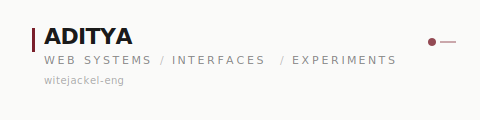

  

I work across web design, frontend engineering, full-stack systems, and interactive environments. Most of what I build uses Next.js and TypeScript, but the interesting parts tend to be the WebGL scenes, motion systems, content architectures, and deployment pipelines that hold everything together.

---

### Current Field

Lately I have been working on mathematical visual systems, procedural audio, and cinematic web environments. The goal is to build interactive experiences where the underlying logic is visible and controllable, not just decorative.

---

### Selected Repositories

**01 / DUST//SIGNAL**
Interactive computational environment using Three.js, custom GLSL shaders, GSAP, Web Audio API, and seeded mathematical simulations. Includes stochastic models, a Monte Carlo chamber, and a procedural sequencer.

[Repository](https://github.com/witejackel-eng/dune) · [Live](https://dune-aditya.vercel.app)
`Next.js / TypeScript / Three.js / GLSL / GSAP / Web Audio`

---

**02 / Saffron & Steam**
Immersive café website with a WebGL hero scene, editorial typography, day-to-night scroll sequences, and an interactive signature-menu rail. Built around a Delhi garden café at golden hour.

[Repository](https://github.com/witejackel-eng/saffron-steam-experience) · [Live](https://saffron-steam-experience.vercel.app)
`Next.js / TypeScript / Three.js / GSAP`

---

**03 / Aarohan Legal**
Editorial website for a boutique Indian legal practice. Procedural WebGL sculpture, custom practice-area illustrations, full-screen navigation, and a content system designed for careful legal review.

[Repository](https://github.com/witejackel-eng/aarohan-legal) · [Live](https://aarohan-legal.vercel.app)
`Next.js / TypeScript / Three.js / React Three Fiber / Framer Motion`

---

**04 / IBS.com**
Corporate website for an AV and IT infrastructure integrator. WhatsApp Cloud API contact flow, Prisma CMS with admin panel, SEO architecture, and security headers. Handles real client traffic on a custom domain.

[Repository](https://github.com/witejackel-eng/IBS.com) · [Live](https://ibsinfra.com)
`Next.js / TypeScript / Prisma / PostgreSQL / WhatsApp API`

---

**05 / Corporate Lead-Gen Platform**
B2B lead-generation SaaS with CMS, blog, account-based marketing tools, and pipeline management. NextAuth authentication, Tiptap rich-text editor, and a WebGL-enhanced landing experience.

[Repository](https://github.com/witejackel-eng/corporate-leadgen-platform) · [Live](https://corporate-leadgen-platform-jet.vercel.app)
`Next.js / Prisma / PostgreSQL / NextAuth / WebGL / Tiptap`

---

**06 / Portfolio**
The site you might have arrived from. Single-page portfolio with case studies, an SEO audit tool, and a contact system. Next.js 16, Tailwind CSS, Framer Motion, and a Vercel deployment.

[Repository](https://github.com/witejackel-eng/dev-aditya.com) · [Live](https://dev-aditya-nine.vercel.app)
`Next.js / TypeScript / Tailwind CSS / Framer Motion`

---

### Systems Index

`Interface systems` — Layouts, typography, component architecture, responsive design
`Interactive 3D` — Three.js, GLSL shaders, procedural environments, Canvas 2D
`Full-stack applications` — Authentication, databases, API routes, CMS
`Ecommerce` — Product catalogs, cart systems, checkout flows
`Dashboards` — Real-time data, SSE streaming, chart visualizations
`Motion` — GSAP, Framer Motion, scroll-driven animation, page transitions
`SEO and metadata` — Structured data, Open Graph, sitemaps, security headers
`Deployment` — Vercel, custom domains, preview deployments, environment config

---

### Working Principles

Interfaces should explain themselves. If a user has to guess what to do next, the layout failed.

Motion should support structure. Animation that does not serve readability or navigation is noise.

Dependencies must justify their presence. Every library in `package.json` should be traceable to a feature.

A deployment is part of the product. A project that builds locally but breaks in production is not finished.

Documentation should reflect the actual system. READMEs that describe a planned feature instead of a shipped one are misleading.

---

Elsewhere: [portfolio](https://dev-aditya-nine.vercel.app) / [email](mailto:hi.aditya.dev@gmail.com) / [github](https://github.com/witejackel-eng)